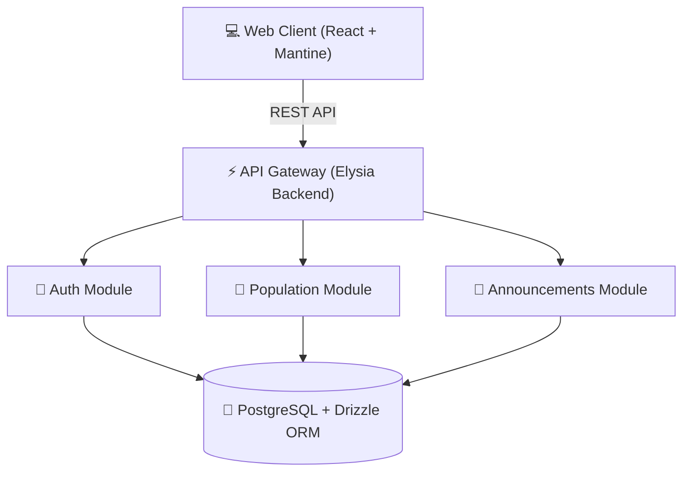

# 🏛️ CivicOS

> **Modern Municipal Management Platform**
> An intuitive, secure, and scalable web platform enabling local governments to manage public services, population registries, department communications, and municipal operations efficiently.

---

## 📌 Overview

**CivicOS** is an open, modular enterprise platform designed to modernize municipal administration. By bridging departmental silos and consolidating administrative workflows into a unified, high-performance interface, CivicOS empowers city officials to make data-driven decisions and deliver seamless public services.



---

## 🛠️ Technology Stack

| Layer | Technology | Description |
| :--- | :--- | :--- |
| **Frontend** | [React](https://react.dev/) + [TypeScript](https://www.typescriptlang.org/) | Type-safe, component-driven UI framework |
| **UI System** | [Mantine UI](https://mantine.dev/) | Enterprise component library & design system |
| **State & Data Fetching** | [TanStack Query v5](https://tanstack.com/query) | Server state management & optimistic caching |
| **Backend Framework** | [Elysia.js](https://elysiajs.com/) | High-performance TypeScript backend engine |
| **Database & ORM** | [PostgreSQL](https://www.postgresql.org/) + [Drizzle ORM](https://orm.drizzle.team/) | Type-safe SQL ORM and schema migrations |
| **Monorepo Architecture** | Feature & Module-based | Decoupled domain architecture for high scalability |

---

## 📚 Documentation Index

All architectural specs, design guidelines, entity schemas, and decision records are maintained in the [`docs/`](./docs) folder:

| Document | Description |
| :--- | :--- |
| 🎯 [**Product Vision & Scope**](./docs/vision.md) | Mission statement, strategic goals, and target outcomes |
| 🏗️ [**System Architecture**](./docs/architecture.md) | High-level system topology, layered design, and domain contracts |
| 🗄️ [**Database & ERD**](./docs/database.md) | Relational schema, field definitions, foreign keys, and ER diagram |
| 🎨 [**Design System**](./docs/design.md) | UI tokens, color palette, typography scale, and layout guidelines |
| 📂 [**Project Structure**](./docs/project-structure.md) | Monorepo layout, package sharing, and frontend/backend directories |
| 🗺️ [**Product Roadmap**](./docs/roadmap.md) | Development phases, milestones, and release targets |
| 🛠️ [**Development Standards**](./docs/development-standards.md) | Coding conventions, Git workflows, error handling, API response formats, & DoD |
| 🤝 [**Contribution Guide**](./CONTRIBUTING.md) | Simple guidelines for submitting features, docs, and bug fixes |
| 📜 [**Architecture Decision Records (ADRs)**](./docs/adr) | Key technical decisions and design rationale |
| 🧩 [**Business Modules**](./docs/modules) | Specifications for domain modules (Auth, Population, Announcements) |

---

## 📁 Repository Directory Overview

```text
CivicOS/
├── 📂 apps/          # Monorepo frontend and backend applications
├── 📂 docker/        # Containerization, Nginx reverse proxy & Postgres services
├── 📂 docs/          # Technical specifications, design tokens, & ADRs
└── 📂 packages/      # Shared TypeScript types, Zod schemas, & utility libs
```

---

## 🚀 Getting Started

> [!NOTE]
> System requirements: Node.js >= 20, Bun >= 1.1, Docker & Docker Compose.

1. **Clone the repository:**
   ```bash
   git clone https://github.com/your-org/civicos.git
   cd Civicos
   ```

2. **Start local infrastructure (PostgreSQL):**
   ```bash
   docker compose -f docker/docker-compose.yml up -d
   ```

3. **Install dependencies:**
   ```bash
   bun install
   ```

---

## 📄 License

This project is licensed under the [**MIT License**](./LICENSE.md).
