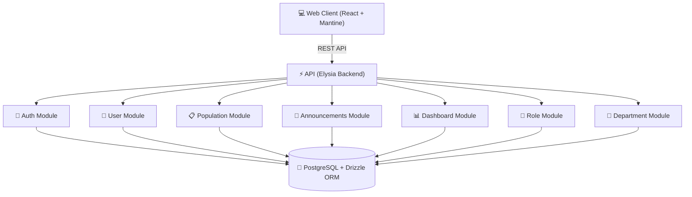

# 🏛️ CivicOS

> **Modern Municipal Management Platform**
> An intuitive, secure, and scalable web platform enabling local governments to manage public services, population registries, department communications, and municipal operations efficiently.

---

## 📌 Overview

**CivicOS** is an open, modular enterprise platform designed to modernize municipal administration. By bridging departmental silos and consolidating administrative workflows into a unified, high-performance interface, CivicOS empowers city officials to make data-driven decisions and deliver seamless public services.



---

## 🛠️ Technology Stack

| Layer                     | Technology                                                                           | Description                                              |
| :------------------------ | :----------------------------------------------------------------------------------- | :------------------------------------------------------- |
| **Frontend**              | [React](https://react.dev/) + [TypeScript](https://www.typescriptlang.org/)          | Type-safe, component-driven UI framework                 |
| **UI System**             | [Mantine UI](https://mantine.dev/)                                                   | Enterprise component library & design system             |
| **State & Data Fetching** | [TanStack Query v5](https://tanstack.com/query)                                      | Server state management & caching                        |
| **Backend Framework**     | [Elysia.js](https://elysiajs.com/)                                                   | High-performance TypeScript backend engine               |
| **Database & ORM**        | [PostgreSQL](https://www.postgresql.org/) + [Drizzle ORM](https://orm.drizzle.team/) | Type-safe SQL ORM and schema migrations                  |
| **Runtime & PM**          | [Bun](https://bun.sh/)                                                               | Single runtime for dev, test, and production             |
| **Infrastructure**        | [Docker Compose](https://docs.docker.com/compose/)                                   | Dev stack (bind mounts) + production stack (Nginx + API) |

---

## 📚 Documentation Index

All architectural specs, design guidelines, entity schemas, and decision records are maintained in the [`docs/`](./docs) folder:

| Document                                                            | Description                                                                |
| :------------------------------------------------------------------ | :------------------------------------------------------------------------- |
| 🎯 [**Product Vision & Scope**](./docs/vision.md)                   | Mission statement, strategic goals, and target outcomes                    |
| 🏗️ [**System Architecture**](./docs/architecture.md)                | High-level system topology, layered design, and domain contracts           |
| 🗄️ [**Database & ERD**](./docs/database.md)                         | Relational schema, field definitions, foreign keys, and ER diagram         |
| 🎨 [**Design System**](./docs/design.md)                            | UI tokens, color palette, typography scale, and layout guidelines          |
| 📂 [**Project Structure**](./docs/project-structure.md)             | Monorepo layout and frontend/backend directories                           |
| 🗺️ [**Product Roadmap**](./docs/roadmap.md)                         | Development phases, milestones, and release targets                        |
| 🛠️ [**Development Standards**](./docs/development-standards.md)     | Coding conventions, Git workflows, & DoD                                   |
| 🚀 [**Deployment Runbook**](./docs/deployment.md)                   | VPS production deployment with Docker Compose                              |
| 🤝 [**Contribution Guide**](./CONTRIBUTING.md)                      | Guidelines for submitting features, docs, and bug fixes                    |
| 📜 [**Architecture Decision Records (ADRs)**](./docs/adr/README.md) | Categorized decision log (28 records: Monorepo, FE, BE, DevOps)            |
| 🧩 [**Business Modules**](./docs/modules)                           | Specifications for domain modules (Auth, Users, Population, Announcements) |

---

## 📁 Repository Directory Overview

```text
CivicOS/
├── 📂 apps/                     # api (Elysia) + web (React/Vite)
├── 📂 docs/                     # Architecture, ADRs, module specs, deployment runbook
├── 📂 specs/                    # Spec-driven docs per feature (requirements → design → tasks)
├── 📄 docker-compose.yml        # Dev stack (Postgres, API, Web — bind mounts, hot reload)
├── 📄 docker-compose.prod.yml   # Production stack (Nginx + API + Postgres, no bind mounts)
├── 📄 package.json              # Bun workspace root
└── 📄 .env.example              # Environment variable template (ADR-021)
```

---

## 🚀 Getting Started

> [!NOTE]
> Requirements: [Bun](https://bun.sh/) ≥ 1.x and Docker with the Compose plugin. CivicOS is a pure-Bun project (ADR-009) — no Node.js/npm needed.

1. **Clone the repository:**

   ```bash
   git clone <your-repo-url> civicos
   cd civicos
   ```

2. **Install dependencies:**

   ```bash
   bun install
   ```

3. **Configure environment:**

   ```bash
   cp .env.example .env.local   # dev values (secrets stay out of git)
   ```

4. **Start the dev stack (PostgreSQL + API + Web with hot reload):**

   ```bash
   docker compose up -d
   ```

5. **Migrate & seed the database:**

   ```bash
   bun run --cwd apps/api db:migrate
   bun run --cwd apps/api db:seed
   ```

6. **Open the app:**
   - Web: http://localhost:5173
   - API: http://localhost:3000

---

## 🧪 Testing

```bash
docker compose up -d postgres-test   # isolated test database (ADR-026)
bun run test                         # 54 tests: unit + API integration
```

> [!NOTE]
> Use `bun run test`, not plain `bun test`. The script passes `--preload ./src/test/setup.ts`, which points `DATABASE_URL` at the isolated test database before the database client loads. Plain `bun test` skips the preload, falls back to the dev database from `.env.local`, and the API tests fail with `ECONNREFUSED`.

---

## 🌐 Production

See the [**Deployment Runbook**](./docs/deployment.md): production images (`Dockerfile.prod`), Nginx single-origin proxy (ADR-023), and a verified `docker-compose.prod.yml` stack.

---

## 📄 License

This project is licensed under the [**MIT License**](./LICENSE.md).
