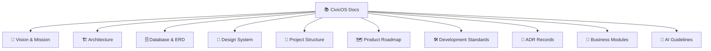

# 📚 CivicOS Documentation Portal

Welcome to the **CivicOS** documentation hub. This directory contains the complete technical specifications, architectural guidelines, database schemas, design tokens, and Architecture Decision Records (ADRs) for CivicOS.

---

## 🗂️ Documentation Map

---

## 📋 Table of Contents

### 1. Core Specifications

- [**Product Vision & Scope**](./vision.md)  
  _Defines the product purpose, municipal mission, target audience, and high-level goals._

- [**System Architecture**](./architecture.md)  
  _Detailed breakdown of monorepo design, layered architecture, technology choices, and service boundaries._

- [**Database Schema & ERD**](./database.md)  
  _Entity definitions, relational mappings, foreign key constraints, data dictionary, and visual ERD._

- [**Design System Guidelines**](./design.md)  
  _Design philosophy, color tokens, typography scale, component standards, accessibility rules, and layout specs._

- [**Project Structure**](./project-structure.md)  
  _Organization of apps, packages, feature folders, global assets, and monorepo conventions._

- [**Product Roadmap**](./roadmap.md)  
  _Phase-by-phase execution plan, milestone timelines, and feature rollout tracking._

- [**Development Standards**](./development-standards.md)  
  _Coding conventions, Git workflows, error handling protocols, API contracts, AI policy, and DoD checklist._

---

### 2. Architecture Decision Records (ADRs)

All architectural decisions are documented in the [**ADR Registry (`docs/adr/`)**](./adr/README.md):

| Category               | Key Decisions Included                                                                                                                                                                          | Full Registry                                                 |
| :--------------------- | :---------------------------------------------------------------------------------------------------------------------------------------------------------------------------------------------- | :------------------------------------------------------------ |
| 🏗️ **Monorepo & Core** | Monorepo (`001`), Bun Runtime (`008`), Pure Bun (`009`), Templates (`010`), Dependencies (`011`)                                                                                                | [View Specs ➔](./adr/README.md#-1-monorepo--core-toolchain)   |
| 💻 **Frontend & UI**   | React + Vite (`002`), Feature Structure (`005`), Mantine (`007`), App Shell (`012`)                                                                                                             | [View Specs ➔](./adr/README.md#-2-frontend--design-system)    |
| ⚡ **Backend & Data**  | REST API (`003`), Layered Model (`004`), Foreign Keys (`006`), Domain Modules (`013`), Soft Delete (`020`), JWT Sessions (`022`)                                                                | [View Specs ➔](./adr/README.md#-3-backend--data-architecture) |
| 🐳 **DevOps & Infra**  | Docker Compose (`014`), `.dockerignore` (`015`), Layer Caching (`016`), Bind Mounts (`017`), All Interfaces (`018`), Incremental Compose (`019`), Env Config (`021`), Same-Origin Proxy (`023`) | [View Specs ➔](./adr/README.md#-4-infrastructure--devops)     |

<b>📜 Click to Expand Complete ADR List (23 Records)</b>

- [**ADR-001: Monorepo Architecture**](./adr/ADR-001-monorepo.md)
- [**ADR-002: React + Vite Frontend**](./adr/ADR-002-react-vite.md)
- [**ADR-003: REST API Paradigm**](./adr/ADR-003-rest-api.md)
- [**ADR-004: Layered Architecture**](./adr/ADR-004-layered-architecture.md)
- [**ADR-005: Feature-Based Structure**](./adr/ADR-005-feature-based-structure.md)
- [**ADR-006: Foreign Key Normalization**](./adr/ADR-006-foreign-keys.md)
- [**ADR-007: Mantine Design System**](./adr/ADR-007-mantine-design-system.md)
- [**ADR-008: Bun Runtime & Package Manager**](./adr/ADR-008-bun-runtime.md)
- [**ADR-009: Pure Bun Project**](./adr/ADR-009-pure-bun-project.md)
- [**ADR-010: Official Project Templates**](./adr/ADR-010-official-templates.md)
- [**ADR-011: Strict Dependency Ownership**](./adr/ADR-011-dependency-ownership.md)
- [**ADR-012: Feature-Oriented Frontend Structure**](./adr/ADR-012-feature-oriented-frontend.md)
- [**ADR-013: Feature-Based Backend Modules**](./adr/ADR-013-feature-based-backend-modules.md)
- [**ADR-014: Containerized Development Environment**](./adr/ADR-014-containerized-dev-environment.md)
- [**ADR-015: Ignore Local Files in Docker**](./adr/ADR-015-ignore-local-files-in-docker.md)
- [**ADR-016: Optimize Docker Layer Caching**](./adr/ADR-016-optimize-docker-layer-caching.md)
- [**ADR-017: Development Containers Use Bind Mounts**](./adr/ADR-017-dev-containers-bind-mounts.md)
- [**ADR-018: Development Servers Must Listen on All Interfaces**](./adr/ADR-018-dev-servers-listen-all-interfaces.md)
- [**ADR-019: Incremental Docker Compose Configuration**](./adr/ADR-019-incremental-docker-compose.md)
- [**ADR-020: User Account Deactivation via Soft Delete**](./adr/ADR-020-soft-delete-user-accounts.md)
- [**ADR-021: Environment-Based Configuration**](./adr/ADR-021-environment-configuration.md)
- [**ADR-022: JWT Session Management**](./adr/ADR-022-jwt-session-management.md)
- [**ADR-023: Same-Origin API Proxy**](./adr/ADR-023-same-origin-api-proxy.md)

---

### 3. Business Modules Specs

Located in [`docs/modules/`](./modules):

- [**Authentication & Authorization Module**](./modules/auth.md) — _RBAC, JWT tokens, session handling_
- [**Population Registry Module**](./modules/population.md) — _Resident information management_
- [**Announcements Module**](./modules/announcement.md) — _Official municipal bulletins & statuses_

---

### 4. AI Assistant Guidelines

- [**AI Assistant Guidelines (`agents.md`)**](../agents.md)  
  _Defines how AI assistants support CivicOS development: AI explains, suggests, and reviews — the developer writes the code._
- [**Feature Planning Templates (`specs/_templates/`)**](../specs/_templates/)  
  _Optional templates for the developer's own feature planning (requirements, design, tasks)._

---

## 💡 Document Conventions

> [!TIP]
>
> - All new architecture decisions **must** follow the MADR format in `docs/adr/ADR-XXX.md`.
> - Diagramming uses standard [Mermaid syntax](https://mermaid.js.org/).
> - Shared types and domain schemas must be referenced from `packages/shared`.
