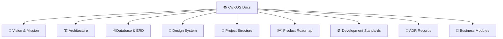

# 📚 CivicOS Documentation Portal

Welcome to the **CivicOS** documentation hub. This directory contains the complete technical specifications, architectural guidelines, database schemas, design tokens, and Architecture Decision Records (ADRs) for CivicOS.

---

## 🗂️ Documentation Map

---

## 📋 Table of Contents

### 1. Core Specifications

- [**Product Vision & Scope**](./vision.md)  
  *Defines the product purpose, municipal mission, target audience, and high-level goals.*

- [**System Architecture**](./architecture.md)  
  *Detailed breakdown of monorepo design, layered architecture, technology choices, and service boundaries.*

- [**Database Schema & ERD**](./database.md)  
  *Entity definitions, relational mappings, foreign key constraints, data dictionary, and visual ERD.*

- [**Design System Guidelines**](./design.md)  
  *Design philosophy, color tokens, typography scale, component standards, accessibility rules, and layout specs.*

- [**Project Structure**](./project-structure.md)  
  *Organization of apps, packages, feature folders, global assets, and monorepo conventions.*

- [**Product Roadmap**](./roadmap.md)  
  *Phase-by-phase execution plan, milestone timelines, and feature rollout tracking.*

- [**Development Standards**](./development-standards.md)  
  *Coding conventions, Git workflows, error handling protocols, API contracts, AI policy, and DoD checklist.*

---

### 2. Architecture Decision Records (ADRs)

Located in [`docs/adr/`](./adr):

- [**ADR-001: Monorepo Architecture**](./adr/ADR-001-monorepo.md) — *Unified workspace for frontend, API, & shared libs*
- [**ADR-002: React + Vite Frontend**](./adr/ADR-002-react-vite.md) — *Modern SPA tooling & rapid developer HMR feedback*
- [**ADR-003: REST API Paradigm**](./adr/ADR-003-rest-api.md) — *Standard HTTP verbs, status codes, & DTO contracts*
- [**ADR-004: Layered Architecture**](./adr/ADR-004-layered-architecture.md) — *Presentation ➔ Business ➔ Data separation*
- [**ADR-005: Feature-Based Structure**](./adr/ADR-005-feature-based-structure.md) — *Frontend feature encapsulation*
- [**ADR-006: Foreign Key Normalization**](./adr/ADR-006-foreign-keys.md) — *Relational integrity over duplicated text*
- [**ADR-007: Mantine Design System**](./adr/ADR-007-mantine-design-system.md) — *Enterprise UI component foundation*
- [**ADR-008: Bun Runtime & Package Manager**](./adr/ADR-008-bun-runtime.md) — *Primary JS/TS runtime, package manager, & workspace runner*

---

### 3. Business Modules Specs

Located in [`docs/modules/`](./modules):

- [**Authentication & Authorization Module**](./modules/auth.md) — *RBAC, JWT tokens, session handling*
- [**Population Registry Module**](./modules/population.md) — *Resident information management*
- [**Announcements Module**](./modules/announcement.md) — *Official municipal bulletins & statuses*

---

## 💡 Document Conventions

> [!TIP]
> - All new architecture decisions **must** follow the MADR format in `docs/adr/ADR-XXX.md`.
> - Diagramming uses standard [Mermaid syntax](https://mermaid.js.org/).
> - Shared types and domain schemas must be referenced from `packages/shared`.
