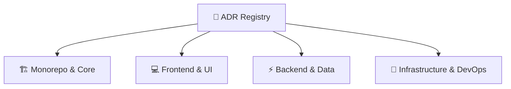

# 📜 Architecture Decision Record (ADR) Registry

> **Decision Log**: Complete index of architectural decision records governing CivicOS system design, technology stack, directory organization, and infrastructure.

---

## 🗂️ Categorized ADR Index

---

### 🏗️ 1. Monorepo & Core Toolchain

| ADR                                              | Title                             | Status        | Primary Decision                                              |
| :----------------------------------------------- | :-------------------------------- | :------------ | :------------------------------------------------------------ |
| [**ADR-001**](./ADR-001-monorepo.md)             | **Monorepo Architecture**         | `Accepted` 🟢 | Unified workspace repository for web, API, and packages       |
| [**ADR-008**](./ADR-008-bun-runtime.md)          | **Bun Runtime & Package Manager** | `Accepted` 🟢 | Adopt Bun as primary JS/TS runtime and package manager        |
| [**ADR-009**](./ADR-009-pure-bun-project.md)     | **Pure Bun Project**              | `Accepted` 🟢 | Strict enforcement of Bun across dev, scripts, and production |
| [**ADR-010**](./ADR-010-official-templates.md)   | **Official Project Templates**    | `Accepted` 🟢 | Use official framework starters for application scaffolding   |
| [**ADR-011**](./ADR-011-dependency-ownership.md) | **Dependency Ownership**          | `Accepted` 🟢 | Scope dependencies strictly to the smallest requiring package |

---

### 💻 2. Frontend & Design System

| ADR                                                   | Title                                | Status        | Primary Decision                                                       |
| :---------------------------------------------------- | :----------------------------------- | :------------ | :--------------------------------------------------------------------- |
| [**ADR-002**](./ADR-002-react-vite.md)                | **React + Vite Frontend**            | `Accepted` 🟢 | Single Page Application (SPA) framework with Vite HMR                  |
| [**ADR-005**](./ADR-005-feature-based-structure.md)   | **Feature-Based Structure**          | `Accepted` 🟢 | Co-locate UI, hooks, and services by domain feature                    |
| [**ADR-007**](./ADR-007-mantine-design-system.md)     | **Mantine UI Adoption**              | `Accepted` 🟢 | Standardized UI component library and design system foundation         |
| [**ADR-012**](./ADR-012-feature-oriented-frontend.md) | **Feature-Oriented Frontend Layout** | `Accepted` 🟢 | Feature domain modules with core app shell under `src/app/`            |
| [**ADR-025**](./ADR-025-shared-query-hooks.md)        | **Shared Query Hooks & Cache**       | `Accepted` 🟢 | Cross-feature hooks in `src/lib/`; reuse owning hooks for shared cache |

---

### ⚡ 3. Backend & Data Architecture

| ADR                                                       | Title                             | Status        | Primary Decision                                                               |
| :-------------------------------------------------------- | :-------------------------------- | :------------ | :----------------------------------------------------------------------------- |
| [**ADR-003**](./ADR-003-rest-api.md)                      | **REST API Architecture**         | `Accepted` 🟢 | Resource-oriented HTTP REST API with JSON response envelopes                   |
| [**ADR-004**](./ADR-004-layered-architecture.md)          | **Layered Architecture**          | `Accepted` 🟢 | Strict separation across Presentation, Business, and Data layers               |
| [**ADR-006**](./ADR-006-foreign-keys.md)                  | **Foreign Key Normalization**     | `Accepted` 🟢 | Relational foreign keys over duplicated string fields                          |
| [**ADR-013**](./ADR-013-feature-based-backend-modules.md) | **Feature-Based Backend Modules** | `Accepted` 🟢 | Organize backend code by business domain modules (`src/modules/`)              |
| [**ADR-020**](./ADR-020-soft-delete-user-accounts.md)     | **User Account Deactivation**     | `Accepted` 🟢 | Disable users via `isActive` flag; never hard-delete to preserve audit history |
| [**ADR-022**](./ADR-022-jwt-session-management.md)        | **JWT Session Management**        | `Accepted` 🟢 | Short-lived in-memory access token + long-lived HttpOnly refresh cookie        |
| [**ADR-024**](./ADR-024-role-based-access-control.md)     | **Role-Based Access Control**     | `Accepted` 🟢 | Reusable `requireRole` guard plugin with scoped `onBeforeHandle`               |

---

### 🐳 4. Infrastructure & DevOps

| ADR                                                           | Title                               | Status        | Primary Decision                                                                           |
| :------------------------------------------------------------ | :---------------------------------- | :------------ | :----------------------------------------------------------------------------------------- |
| [**ADR-014**](./ADR-014-containerized-dev-environment.md)     | **Containerized Development**       | `Accepted` 🟢 | Docker Compose orchestration for local multi-service parity                                |
| [**ADR-015**](./ADR-015-ignore-local-files-in-docker.md)      | **Ignore Local Development Files**  | `Accepted` 🟢 | Exclude build artifacts, logs, and `.env` secrets via `.dockerignore`                      |
| [**ADR-016**](./ADR-016-optimize-docker-layer-caching.md)     | **Optimize Docker Layer Caching**   | `Accepted` 🟢 | Copy `package.json` & `bun.lock` before source to maximize build cache                     |
| [**ADR-017**](./ADR-017-dev-containers-bind-mounts.md)        | **Development Bind Mounts**         | `Accepted` 🟢 | Mount local source into dev containers for live reloading                                  |
| [**ADR-018**](./ADR-018-dev-servers-listen-all-interfaces.md) | **All Interfaces Dev Binding**      | `Accepted` 🟢 | Bind dev servers to `0.0.0.0` for host machine container access                            |
| [**ADR-019**](./ADR-019-incremental-docker-compose.md)        | **Incremental Docker Compose**      | `Accepted` 🟢 | Add services and configs to `docker-compose.yml` only when needed                          |
| [**ADR-021**](./ADR-021-environment-configuration.md)         | **Environment-Based Configuration** | `Accepted` 🟢 | Store secrets in `.env` & document variables via committed `.env.example`                  |
| [**ADR-023**](./ADR-023-same-origin-api-proxy.md)             | **Same-Origin API Proxy**           | `Accepted` 🟢 | Browser talks only to the web origin; `/api` proxied to the backend (Vite dev, Nginx prod) |
