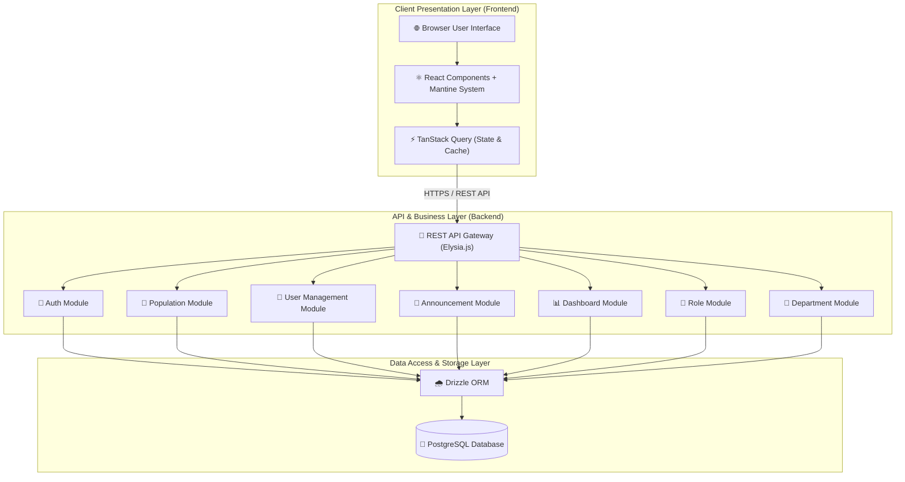
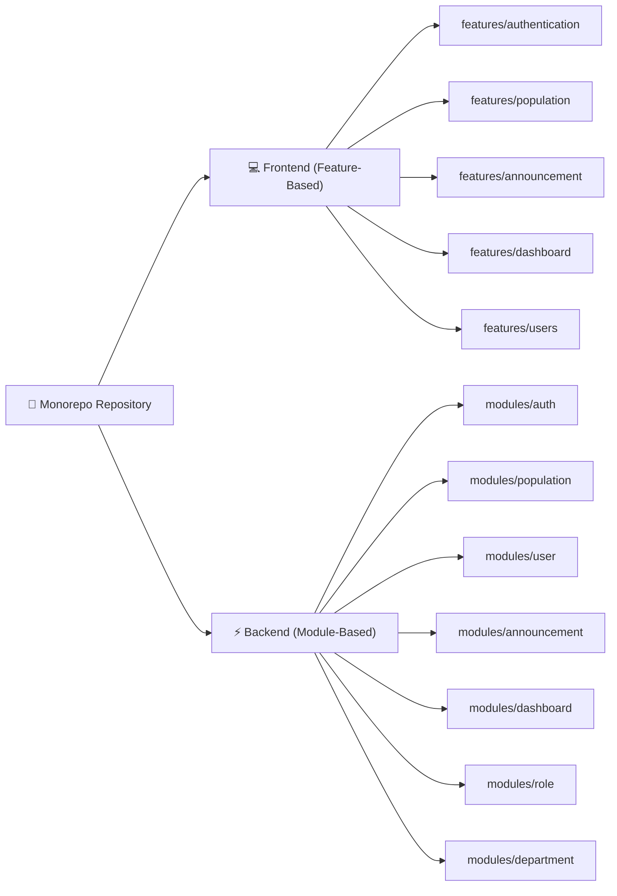
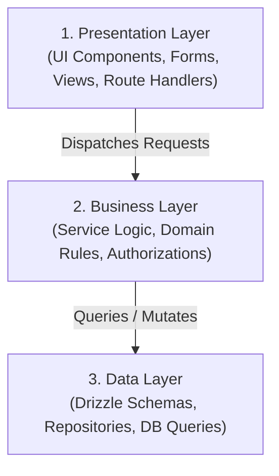

# 🏗️ System Architecture & Engineering Specifications

> **System Overview**: High-level technical architecture, layered design patterns, domain isolation boundaries, and monorepo structure for CivicOS.

---

## 📐 Architecture Overview

CivicOS adopts a **decoupled monorepo design** pairing a high-performance **Elysia.js TypeScript backend** with a **React + Mantine UI frontend**. Clear separation of concerns is maintained across the presentation layer, business logic layer, and database access layer.

---

## 🧩 Monorepo Structural Paradigms

### 1. Feature-Based Architecture (Frontend)

The frontend application organizes UI components, local state, hook logic, and API calls by **domain feature** rather than technical layer (such as having a global `components/` or `hooks/` dump).

- Each feature directory is self-contained.
- Features expose a clean public API (`index.ts`) for cross-feature interactions.

### 2. Module-Based Architecture (Backend)

The backend decouples business features into independent, self-contained **domain modules**.

- Modules encapsulate route handlers, business services, and database queries.
- Direct database calls from route handlers are prohibited.

---

## 🏛️ Layered Architectural Model

### Layer Responsibilities & Rules:

| Layer                  | Responsibility                                                                             | Strict Boundary Rules                                                        |
| :--------------------- | :----------------------------------------------------------------------------------------- | :--------------------------------------------------------------------------- |
| **Presentation Layer** | Renders UI, handles user input, converts API requests into service calls.                  | Must not perform direct SQL/ORM queries or contain core domain calculations. |
| **Business Layer**     | Implements business logic, validation rules, RBAC permission checks, data transformations. | Framework-agnostic. Must not directly access HTTP request/response objects.  |
| **Data Layer**         | Defines database tables (Drizzle ORM), handles database transactions, manages SQL queries. | Pure data persistence. Contains no business authorization logic.             |

---

## 🎯 Core Architectural Principles

1. **Strict REST Interface Contract**  
   The frontend communicates exclusively with the backend via strongly typed REST API endpoints. The API is the source of truth for wire shapes; the web app mirrors them as local interfaces (ADR-028).

2. **Domain Encapsulation**  
   Modules and features own their domain logic. Cross-module communications are explicitly routed through defined service boundaries.

3. **Single Source of Truth**  
   All persistence logic flows through PostgreSQL via Drizzle ORM. Entity relations use relational foreign keys with referential integrity.

4. **Predictable Data Fetching**  
   Client-side server state management uses TanStack Query v5 with optimistic updates, structured caching, and automatic refetching. Auth/session state is the exception: it is application state and lives in a React context (`apps/web/src/features/authentication/auth-context.tsx`) backed by the axios API client in `apps/web/src/services/api-client.ts`.
