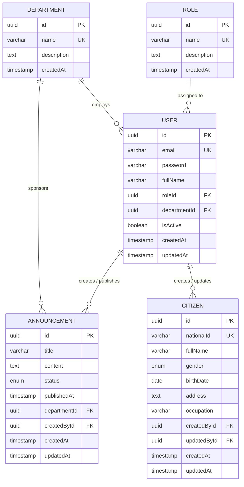

# 🗄️ Database Architecture & Entity Specifications

> **Engine**: PostgreSQL 16+  
> **ORM**: Drizzle ORM  
> **Schema Management**: Declarative TypeScript Schemas & Automated Drizzle Migrations  

---

## 📊 Entity-Relationship Diagram (ERD)

---

## 📋 Entity Data Dictionary

### 1. `users` (System Accounts)

Represents municipal employees, officers, department heads, and administrators accessing CivicOS.

| Field | Data Type | Constraints | Description |
| :--- | :--- | :--- | :--- |
| `id` | `UUID` | `PRIMARY KEY`, Default `gen_random_uuid()` | Unique user account identifier |
| `email` | `VARCHAR(255)` | `NOT NULL`, `UNIQUE` | Official work email address |
| `password` | `VARCHAR(255)` | `NOT NULL` | Argon2id / bcrypt hashed password string |
| `fullName` | `VARCHAR(150)` | `NOT NULL` | Employee full display name |
| `roleId` | `UUID` | `NOT NULL`, `FK -> roles(id)` | Foreign key referencing assigned system role |
| `departmentId` | `UUID` | `NULLABLE`, `FK -> departments(id)` | Foreign key referencing assigned department |
| `isActive` | `BOOLEAN` | `NOT NULL`, Default `true` | Account activation status flag |
| `createdAt` | `TIMESTAMPTZ` | `NOT NULL`, Default `NOW()` | Record creation timestamp |
| `updatedAt` | `TIMESTAMPTZ` | `NOT NULL`, Default `NOW()` | Record last modification timestamp |

---

### 2. `roles` (Access Permissions)

Note: A user's position is represented by combining their Role (authority level) and Department (organizational unit). For example, a user with the role Officer in the Population department is effectively a Population Officer.

Defines Role-Based Access Control (RBAC) levels across CivicOS.

| Field | Data Type | Constraints | Description |
| :--- | :--- | :--- | :--- |
| `id` | `UUID` | `PRIMARY KEY`, Default `gen_random_uuid()` | Unique role identifier |
| `name` | `VARCHAR(50)` | `NOT NULL`, `UNIQUE` | Role name (`Officer`, `Manager`, `Administrator`, `Mayor`) |
| `description` | `TEXT` | `NULLABLE` | Human-readable explanation of permissions |
| `createdAt` | `TIMESTAMPTZ` | `NOT NULL`, Default `NOW()` | Record creation timestamp |

---

### 3. `departments` (Municipal Departments)

Represents government divisions (e.g., Population, Finance, Transportation, Public Relations).

| Field | Data Type | Constraints | Description |
| :--- | :--- | :--- | :--- |
| `id` | `UUID` | `PRIMARY KEY`, Default `gen_random_uuid()` | Unique department identifier |
| `name` | `VARCHAR(100)` | `NOT NULL`, `UNIQUE` | Department title |
| `description` | `TEXT` | `NULLABLE` | Function & scope description |
| `createdAt` | `TIMESTAMPTZ` | `NOT NULL`, Default `NOW()` | Record creation timestamp |

---

### 4. `citizens` (Population Registry)

Stores demographic records managed by the Population Department.

| Field | Data Type | Constraints | Description |
| :--- | :--- | :--- | :--- |
| `id` | `UUID` | `PRIMARY KEY`, Default `gen_random_uuid()` | Unique citizen record identifier |
| `nationalId` | `VARCHAR(20)` | `NOT NULL`, `UNIQUE` | National identification number (NIK / SSN) |
| `fullName` | `VARCHAR(150)` | `NOT NULL` | Legal full name |
| `gender` | `ENUM` | `NOT NULL` (`MALE`, `FEMALE`) | Biological sex identifier |
| `birthDate` | `DATE` | `NOT NULL` | Date of birth |
| `address` | `TEXT` | `NOT NULL` | Primary residential address |
| `occupation` | `VARCHAR(100)` | `NULLABLE` | Current primary occupation |
| `createdById` | `UUID` | `NOT NULL`, `FK -> users(id)` | User who registered this citizen record |
| `updatedById` | `UUID` | `NULLABLE`, `FK -> users(id)` | User who last updated this citizen record |
| `createdAt` | `TIMESTAMPTZ` | `NOT NULL`, Default `NOW()` | Record creation timestamp |
| `updatedAt` | `TIMESTAMPTZ` | `NOT NULL`, Default `NOW()` | Record last update timestamp |

---

### 5. `announcements` (Public Bulletins)

Stores government announcements published through CivicOS.

| Field | Data Type | Constraints | Description |
| :--- | :--- | :--- | :--- |
| `id` | `UUID` | `PRIMARY KEY`, Default `gen_random_uuid()` | Unique announcement identifier |
| `title` | `VARCHAR(255)` | `NOT NULL` | Bulletin title header |
| `content` | `TEXT` | `NOT NULL` | Body content (Markdown format supported) |
| `status` | `ENUM` | `NOT NULL` (`DRAFT`, `PUBLISHED`, `ARCHIVED`) | Publication workflow state |
| `publishedAt` | `TIMESTAMPTZ` | `NULLABLE` | Timestamp when published to public |
| `departmentId` | `UUID` | `NOT NULL`, `FK -> departments(id)` | Publishing department |
| `createdById` | `UUID` | `NOT NULL`, `FK -> users(id)` | Author user account |
| `createdAt` | `TIMESTAMPTZ` | `NOT NULL`, Default `NOW()` | Creation timestamp |
| `updatedAt` | `TIMESTAMPTZ` | `NOT NULL`, Default `NOW()` | Last modification timestamp |

---

## 🔒 Database Indexing & Performance Rules

1. **Foreign Key Indexing**: B-Tree indexes must be created on all FK columns (`roleId`, `departmentId`, `createdById`, `updatedById`) to maintain fast `JOIN` performance.
2. **Search Indexing**: Trigram B-Tree / GIN indexes on `citizens.fullName`, `citizens.nationalId`, and `announcements.title` for instant text searching.
3. **Audit Trail**: High-stakes tables (`citizens`, `announcements`) record `createdById` and `updatedById` to enforce accountability.