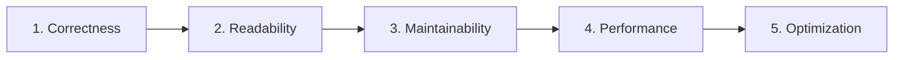

# 🛠️ CivicOS Development & Engineering Standards

> **Engineering Guidelines**: Coding conventions, naming standards, Git workflows, error handling protocols, API contracts, and Definition of Done (DoD).

---

## 🎯 Core Development Philosophy

CivicOS follows a **"Function First, Polish Continuously"** engineering methodology.

### Development Priority Scale:



1. **Correctness**: Feature logic must produce verified, accurate results under all conditions before optimization.
2. **Readability**: Code must be explicit and self-explanatory. Favor clear intent over clever shortcuts.
3. **Maintainability**: Follow monorepo and feature module boundaries to minimize tech debt.
4. **Performance**: Ensure smooth rendering and fast query responses without premature abstraction.
5. **Optimization**: Profile before tuning algorithms or caching data.

---

## 🏷️ Naming & Directory Conventions

### 1. Identifier Naming Rules

| Category | Convention | Pattern Example | Usage Context |
| :--- | :--- | :--- | :--- |
| **Files & Directories** | `kebab-case` | `user-table.tsx`, `create-user-dialog.tsx` | All component files, hooks, utilities |
| **React Components** | `PascalCase` | `function UserTable() {}` | Component function declarations |
| **Variables & Functions** | `camelCase` | `const currentUser`, `fetchCitizens()` | Local state, functions, parameters |
| **Constants & Enums** | `UPPER_SNAKE_CASE` | `const MAX_LOGIN_ATTEMPTS = 5` | System constants, static config |
| **TypeScript Types & Interfaces** | `PascalCase` | `type User = {}`, `interface CreateUserRequest` | Type definitions and interfaces |

### 2. Component Directory Placement

> [!IMPORTANT]
> Never put feature-specific components inside the global `components/` directory.

```text
❌ INCORRECT (Global Pollution):
src/components/UserTable.tsx

✅ CORRECT (Feature Encapsulated):
src/features/users/components/user-table.tsx
```

---

## 📦 Import Ordering Standard

Imports within all source files (`.ts`, `.tsx`) MUST follow a grouped, predictable order:

```typescript
// 1. External Third-Party Libraries
import { Button, TextInput } from "@mantine/core";
import { useQuery } from "@tanstack/react-query";

// 2. Internal Monorepo Packages & Features
import { UserTable } from "@/features/users";
import { formatDate } from "@/lib/utils";

// 3. Type-Only Imports
import type { User, Role } from "@civicos/shared";
```

---

## 🌿 Git Workflow & Branching Strategy

### 1. Conventional Commit Standard

All commit messages MUST follow the [Conventional Commits](https://www.conventionalcommits.org/) specification:

```text
<type>(<scope>): <short description>
```

| Commit Type | Purpose | Example |
| :--- | :--- | :--- |
| `feat` | New user-facing feature | `feat(auth): add login endpoint and JWT handling` |
| `fix` | Bug fix in code | `fix(population): validate unique nationalId before submit` |
| `docs` | Documentation updates | `docs(database): update ERD schema and field specs` |
| `refactor` | Code change without fixing bugs or adding features | `refactor(api): simplify authentication middleware logic` |
| `style` | Code formatting or UI layout adjustment | `style(ui): adjust sidebar padding and font scale` |
| `test` | Adding or updating tests | `test(auth): add unit tests for password hashing` |
| `chore` | Build tasks, docker, dependencies | `chore(docker): update postgres compose service version` |

### 2. Branch Naming Strategy

```text
main                    # Production-ready code
develop                 # Staging & integration branch
feature/authentication  # Feature development branches
feature/population      # Feature development branches
fix/login-validation    # Bug fix branches
docs/architecture       # Documentation branches
```

---

## 🚨 Error Handling & API Response Contracts

### 1. Error Handling Protocol

> [!CAUTION]
> Silent error suppression or empty catch blocks are strictly prohibited.

```typescript
// ❌ PROHIBITED:
catch (error) {
  console.log(error);
}

// ✅ MANDATED:
catch (error) {
  logger.error({ error, context: "User Authentication" }, "Failed to authenticate credentials");
  throw new APIException(HTTPStatus.BAD_REQUEST, "Invalid login credentials provided");
}
```

### 2. Standardized API Response Contracts

All REST API endpoints in CivicOS returned from `apps/api` must conform to the standard JSON payload structure:

#### Success Response JSON Format:
```json
{
  "success": true,
  "data": {
    "id": "usr_948201",
    "email": "officer@civicos.gov",
    "fullName": "Jane Doe"
  },
  "message": "User account fetched successfully"
}
```

#### Error Response JSON Format:
```json
{
  "success": false,
  "message": "Citizen record with National ID 10928374 not found",
  "errorCode": "RESOURCE_NOT_FOUND"
}
```

---

## 📝 Documentation & ADR Rules

1. **Document "WHY", Not "WHAT"**:
   - Comments should explain non-obvious business rules or architectural rationale, not restate syntax.
   ```typescript
   // ❌ Bad: Increment counter by 1
   count++;

   // ✅ Good: Track consecutive failed logins to trigger temporary account lockout
   failedLoginAttempts++;
   ```

2. **Architecture Decision Record (ADR) Criteria**:
   - Create a new ADR in [`docs/adr/`](./adr) when making long-term architectural choices (e.g. adopting a framework, database strategy, monorepo tooling).
   - Routine changes (adding an endpoint, editing UI styles, tweaking variables) do not require an ADR.

---

## 🤖 AI Assistance & Code Review Policy

AI coding assistants are integral pair-programming partners for CivicOS development.

### Permitted AI Usage:
- Brainstorming architecture alternatives and data modeling.
- Explaining complex concepts, API patterns, and framework quirks.
- Generating unit test stubs and boilerplate code.
- Reviewing code for potential edge cases or security flaws.

### Developer Accountability:
- **Understand Everything**: Developers must thoroughly inspect and comprehend all AI-generated code before committing.
- **Verify Correctness**: Run local builds, tests, and database migrations to ensure code accuracy.
- **Maintain Architectural Integrity**: AI suggestions must adhere strictly to CivicOS design system and module boundaries.

---

## ✅ Definition of Done (DoD) Checklist

A pull request or feature issue is considered **Complete & Done** when:

- [ ] **Functionality Verified**: Feature meets all functional requirements without runtime crashes.
- [ ] **Type Safety**: TypeScript compilation passes cleanly with zero `any` evasions.
- [ ] **Style & Linting**: Code adheres to project naming conventions, import ordering, and formatting guidelines.
- [ ] **Error Handling**: API errors and UI edge states (loading, empty, error) are gracefully handled.
- [ ] **Clean Code**: All debug statements (`console.log`) and dead code are removed.
- [ ] **Documentation**: Relevant technical docs, API specs, or ADRs are updated.
- [ ] **Deployment Ready**: Code builds cleanly and passes CI/CD pipeline checks.
