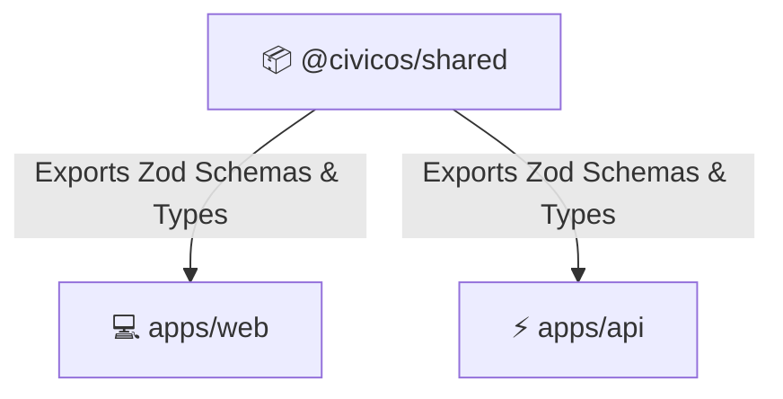

# 📂 Monorepo Project Structure & Conventions

> **Monorepo Architecture**: Decoupled repository organizing apps, packages, documentation, and infrastructure.

---

## 🏗️ High-Level Directory Overview

```text
CivicOS/
├── 📂 apps/                   # Applications (Web Frontend & API Backend)
│   ├── 📂 web/                # React + Mantine Frontend SPA
│   └── 📂 api/                # Elysia.js REST Backend Service
│
├── 📂 packages/               # Shared Monorepo Workspace Packages
│   ├── 📂 shared/             # Shared domain types, interfaces & Zod schemas
│   ├── 📂 config/             # Shared ESLint, Prettier, & Tailwind/CSS configs
│   ├── 📂 types/              # Global TypeScript declaration types
│   ├── 📂 ui/                 # Shared UI component primitives
│   └── 📂 tsconfig/           # Shared TypeScript configuration files
│
├── 📂 docs/                   # Architectural & Product Documentation
│   ├── 📂 adr/                # Architectural Decision Records (ADRs)
│   │   ├── 📄 ADR-001-monorepo.md
│   │   ├── 📄 ADR-002-react-vite.md
│   │   ├── 📄 ADR-003-rest-api.md
│   │   ├── 📄 ADR-004-layered-architecture.md
│   │   ├── 📄 ADR-005-feature-based-structure.md
│   │   ├── 📄 ADR-006-foreign-keys.md
│   │   ├── 📄 ADR-007-mantine-design-system.md
│   │   ├── 📄 ADR-008-bun-runtime.md
│   │   ├── 📄 ADR-009-pure-bun-project.md
│   │   ├── 📄 ADR-010-official-templates.md
│   │   ├── 📄 ADR-011-dependency-ownership.md
│   │   ├── 📄 ADR-012-feature-oriented-frontend.md
│   │   ├── 📄 ADR-013-feature-based-backend-modules.md
│   │   ├── 📄 ADR-014-containerized-dev-environment.md
│   │   ├── 📄 ADR-015-ignore-local-files-in-docker.md
│   │   ├── 📄 ADR-016-optimize-docker-layer-caching.md
│   │   ├── 📄 ADR-017-dev-containers-bind-mounts.md
│   │   ├── 📄 ADR-018-dev-servers-listen-all-interfaces.md
│   │   ├── 📄 ADR-019-incremental-docker-compose.md
│   │   ├── 📄 ADR-020-soft-delete-user-accounts.md
│   │   └── 📄 ADR-021-environment-configuration.md
│   ├── 📂 modules/            # Business Module Specifications
│   ├── 📄 architecture.md     # System architecture spec
│   ├── 📄 database.md         # Database schema & ERD
│   ├── 📄 design.md           # Design system tokens & rules
│   ├── 📄 development-standards.md # Engineering standards & DoD
│   ├── 📄 roadmap.md          # Project rollout roadmap
│   └── 📄 vision.md           # Product vision & goals
│
├── 📂 docker/                 # Containerization & Infrastructure
│   ├── 📄 docker-compose.yml  # Local dev environment composition
│   ├── 📄 nginx.conf          # Nginx reverse proxy configuration
│   └── 📂 postgres/           # Database initialization scripts
│
├── 📄 package.json            # Root Bun workspace manifest & task scripts
├── 📄 tsconfig.json           # Root TypeScript configuration for Bun
└── 📄 LICENSE.md              # MIT Open Source License
```

---

## 📦 Shared Workspace Packages (`packages/`)

To prevent code duplication between the frontend (`apps/web`) and backend (`apps/api`), shared assets are encapsulated within workspace packages:



### Shared Package Breakdown:

- **`@civicos/shared`**: Holds shared domain entities, TypeScript interfaces, Zod validation schemas, and enum definitions (e.g. `User`, `Citizen`, `AnnouncementStatus`).
- **`@civicos/tsconfig`**: Base `tsconfig.json` configurations inherited by sub-projects.

---

## 💻 Frontend Application Layout (`apps/web/src/`)

The frontend follows a **Feature-Based Architecture**. Code related to a specific domain (e.g., Population) is grouped together.

```text
apps/web/src/
├── 📂 app/                    # Routing, providers, & top-level app initialization
├── 📂 features/               # Feature-based domain modules
│   ├── 📂 authentication/     # Login views, auth hooks, session state
│   ├── 📂 population/         # Citizen registry tables, filters, forms
│   ├── 📂 announcement/       # Bulletin creation, status toggles, public feed
│   ├── 📂 users/              # User management & RBAC assignments
│   └── 📂 dashboard/          # Metric cards, departmental analytics
│
├── 📂 components/             # Reusable UI components (Design System)
│   ├── 📂 ui/                 # Buttons, inputs, modals, cards, badges
│   └── 📂 feedback/           # Toast notifications, empty states, loaders
│
├── 📂 layouts/                # Page shell layouts (Header, Sidebar, Footer)
├── 📂 services/               # API client instances (Axios / Fetch wrappers)
├── 📂 lib/                    # Helper functions & utility methods
├── 📂 types/                  # Web-specific frontend types
└── 📂 assets/                 # Static images, logos, icons, fonts
```

---

## ⚡ Backend Application Layout (`apps/api/src/`)

The backend follows a **Feature-Based Domain Architecture** organized into app infrastructure (`src/app/`) and business domain modules (`src/modules/`).

```text
apps/api/src/
├── 📂 app/                    # Application Infrastructure
│   ├── 📂 config/             # DB connection & environment settings
│   ├── 📂 middleware/         # Auth checking, CORS, & error handlers
│   └── 📂 plugins/            # Elysia plugins (JWT, Swagger/OpenAPI)
│
├── 📂 database/               # Data Persistence Layer
│   ├── 📂 schema/             # Drizzle ORM entity definitions
│   └── 📂 migrations/         # Declarative SQL migrations
│
├── 📂 modules/                # Self-contained business domain modules
│   ├── 📂 announcement/       # Bulletin creation, publish/archive workflow
│   ├── 📂 auth/               # Login endpoints, JWT handling, RBAC
│   ├── 📂 population/         # Citizen registry endpoints, search, CRUD services
│   └── 📂 user/               # User management & role provisioning
│
├── 📂 lib/                    # Helper utilities & shared functions
├── 📂 test/                   # Unit + API test suites (bun test, ADR-026)
├── 📂 types/                  # API-specific DTOs & context types
├── 📄 app.ts                  # App builder & route registration (exported for tests)
└── 📄 index.ts                # Server entry point (imports app, binds port)
```

---

## ⚖️ Global vs. Feature-Scoped Conventions

| Code Type             | Scope                           | Placement Directory             | Example                                                |
| :-------------------- | :------------------------------ | :------------------------------ | :----------------------------------------------------- |
| **Global Component**  | Generic, reusable UI component  | `src/components/ui/`            | `<Button>`, `<Modal>`, `<Table>`, `<Navbar>`           |
| **Feature Component** | Specific to one business domain | `src/features/<feature>/`       | `<CitizenForm>`, `<AnnouncementCard>`                  |
| **Global Utility**    | General helper function         | `src/lib/`                      | `formatDate()`, `currencyFormatter()`                  |
| **Shared Hook**       | Cross-feature state/query hook  | `src/lib/`                      | `useRoleOptions()`, `useDepartmentOptions()` (ADR-025) |
| **Feature Hook**      | Business state/query hook       | `src/features/<feature>/hooks/` | `useCitizenQuery()`, `usePublishAnnouncement()`        |
