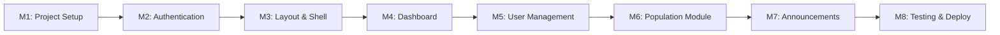

# 🗺️ CivicOS Product Roadmap & Version Release Plan

> **Strategic Execution Plan**: Phased release strategy, versioning milestones, domain expansion (Transportation, Finance, Infrastructure), and Smart City evolution.

---

## 📈 Executive Roadmap & Versioning Strategy

```mermaid
gantt
    title CivicOS Version Release Progress
    dateFormat  YYYY-MM
    section Version 1.0: Core MVP
    Foundation & Auth (M1-M3)    :v1_1,
    Core Modules (M4-M7)         :v1_2,
    Testing & Launch (M8)        :v1_3,
    section Version 1.1 - 1.4: Domain Expansion
    v1.1 Transportation          :v11,
    v1.2 Finance & Budget        :v12,
    v1.3 Infrastructure Works    :v13,
    v1.4 Reports & Analytics     :v14,
    section Version 2.0: Smart City
    v2.0 Smart City Ecosystem    :v20,
```

---

## 🏷️ Version Release Overview

| Version  | Release Title                     | Primary Focus & Domain Modules                                               | Status         |
| :------- | :-------------------------------- | :--------------------------------------------------------------------------- | :------------- |
| **v1.0** | **Core Administration (MVP)**     | Auth, Dashboard, User Management, Population Registry, Announcements         | `Completed` 🟢 |
| **v1.1** | **Transportation & Transit**      | Bus Routes, Bus Stops, Fleet Vehicles, Driver Assignments, Route Status      | `Planned` ⚪   |
| **v1.2** | **Finance & Revenue**             | Annual Budget, Department Budgets, Expenditure Tracking, Revenue Reports     | `Planned` ⚪   |
| **v1.3** | **Infrastructure & Public Works** | Construction Projects, Progress Tracking, Budget Usage, Completion Timelines | `Planned` ⚪   |
| **v1.4** | **Cross-Domain Analytics**        | Consolidated City Intelligence, Inter-departmental Reports & Metrics         | `Planned` ⚪   |
| **v2.0** | **Smart City Platform**           | Public Citizen Portal, Interactive Maps, Notifications, Citizen Requests     | `Future` 🔵    |

---

## 🚀 Version 1.0 — Core MVP Milestones

Version 1.0 establishes the foundational administrative operating system for CivicOS.

### Milestone Progression (v1.0):



| Milestone                   | Scope & Deliverables                                                                                      | Status         |
| :-------------------------- | :-------------------------------------------------------------------------------------------------------- | :------------- |
| **M1: Project Setup**       | Monorepo structure, Bun workspaces (`apps/`), Root `package.json` & `tsconfig.json`                        | `Completed` 🟢 |
| **M2: Authentication**      | Login, Logout, JWT bearer tokens, Refresh token handling, Protected route guards                          | `Completed` 🟢 |
| **M3: App Shell Layout**    | Mantine header, collapsible sidebar, breadcrumb navigation, theme switching                               | `Completed` 🟢 |
| **M4: Executive Dashboard** | City overview stats cards, recent bulletins list, quick action panel                                      | `Completed` 🟢 |
| **M5: User Management**     | Employee directory, account creation, role assignment (`Officer`, `Manager`, `Mayor`), department linking | `Completed` 🟢 |
| **M6: Population Module**   | Citizen registry CRUD, National ID lookup, search/filter, pagination, audit tracking                      | `Completed` 🟢 |
| **M7: Announcements**       | Bulletin creation, publish/archive workflow, department tags                                              | `Completed` 🟢 |
| **M8: Testing & Deploy**    | Deployment Preparation, Docker image packaging, Production Configuration, Basic Testing                   | `Completed` 🟢 |

---

## 🔮 Future Release Specs (v1.1 - v2.0)

### 🚌 Version 1.1 — Transportation & Municipal Transit

Manages public transportation networks, municipal fleet, and transit operations.

- **Bus Routes & Stop Management**: Route mapping, stop coordinates, active schedule management.
- **Fleet & Vehicle Inventory**: Bus fleet details, maintenance logs, inspection status.
- **Driver Assignments & Status**: Duty rosters, real-time route status (`Active`, `Delayed`, `Maintenance`).

---

### 💰 Version 1.2 — Finance & Budget Management

Centralizes municipal fiscal management, departmental budget allocations, and expense tracking.

- **Annual City Budget**: Budget planning, fiscal year targets, department allocations.
- **Expense Tracking & Revenue**: Departmental spending logs, revenue stream records.
- **Financial Audit Reports**: Automated financial summary reports for municipal leadership.

---

### 🏗️ Version 1.3 — Infrastructure & Public Works

Tracks city infrastructure projects, public works, and urban development initiatives.

- **Construction & Project Tracking**: Active municipal projects, contractor assignments, phase timelines.
- **Budget & Cost Tracking**: Percentage completion metrics vs. budget consumption.
- **Status & Risk Monitoring**: Live project status (`Planning`, `In Progress`, `On Hold`, `Completed`).

---

### 📊 Version 1.4 — Cross-Domain Reports & Analytics

Aggregates data across Population, Finance, Transit, and Infrastructure into unified insights.

- **Consolidated City Intelligence**: Cross-referencing population density with transport routes and infrastructure spend.
- **Custom Report Builder**: Exportable executive summaries (PDF/CSV formats).

---

### 🌐 Version 2.0 — Smart City & Public Engagement Platform

Expands CivicOS beyond internal administration into a public-facing smart city ecosystem.

- **Public Citizen Portal**: Self-service portal for residents to view notices and request municipal services.
- **Citizen Service Requests**: Issue reporting (potholes, streetlights, sanitation) with status tracking.
- **Interactive Map Integration**: Geospatial mapping for transit, infrastructure, and district boundaries.
- **Real-Time Push Notifications**: Emergency broadcasts, system activity timelines, and email alerts.

---

## MVP Success Criteria

Version 1.0 is considered complete when:

- Users can authenticate.
- Administrators can manage users.
- Population Officers can manage citizens.
- Public Relations Officers can publish announcements.
- The system is deployable on a VPS using Docker Compose.

---

## 💡 Backlog (Deferred Ideas)

Ideas raised during development that fall outside the agreed milestone scope. They are parked here instead of creeping into the current milestone; pick them up in a future milestone or release.

| Idea                                                             | Source    | Category   | Notes                                                                    |
| :--------------------------------------------------------------- | :-------- | :--------- | :----------------------------------------------------------------------- |
| Soft-void citizen records (`isVoided` + `voidedById`/`voidedAt`) | M6 review | Population | Preferred over hard delete (ADR-020 philosophy); see `specs/population/` |
| CSV import/export                                                | M6 spec   | Population | Bulk operations deferred                                                 |
| NIK auto-suggest search                                          | M6 spec   | Population | Advanced search deferred                                                 |
| Pagination/search for the user directory                         | M5 spec   | Users      | Directory is small for now                                               |
