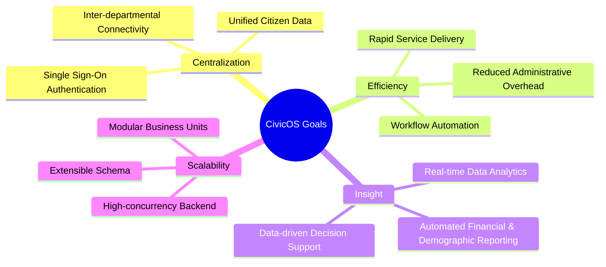

# 🎯 Product Vision & Scope

> **Codename**: `CivicOS`  
> **Tagline**: Modern Municipal Management Platform  
> **Status**: Active Architecture Specification  

---

## 📌 Executive Summary

Modern local governments face fragmented administrative tools, isolated departmental data silos, and slow paper-based workflows. **CivicOS** is designed as a next-generation web operating system for cities and municipalities. It centralizes city operations, citizen registries, financial data, public works, and official announcements into a secure, intuitive, and modular platform.

---

## 👁️ Product Vision

> **CivicOS is a modern web-based municipal management platform that enables local governments to efficiently manage public services, transportation, infrastructure, population, finance, and internal administration through a unified, secure, and scalable system.**

---

## 🚀 Product Mission

> **To simplify municipal operations by providing an intuitive, modular, and extensible platform that supports data-driven decision-making and improves public service management.**

---

## 🏛️ Strategic Goals & Objectives

### Key Pillars:

1. **Reduce Administrative Complexity**  
   Eliminate redundant data entry, simplify form management, and establish consistent user interfaces for municipal staff across all departments.

2. **Centralize Municipal Data**  
   Consolidate disparate databases into a single, audited PostgreSQL source of truth with strict role-based access control (RBAC).

3. **Enhance Inter-Departmental Collaboration**  
   Allow seamless communication and data sharing between Population, Finance, Transportation, and Public Relations departments.

4. **Deliver Actionable Intelligence**  
   Provide city leadership with real-time analytics, population trends, operational bottlenecks, and financial reporting.

5. **Scale Gracefully with Urban Growth**  
   Architect a monorepo solution capable of expanding from small townships to large metropolises without structural redesign.

---

## 👥 Target Stakeholders & User Roles

| Role | Primary Responsibility | Primary Platform Interaction |
| :--- | :--- | :--- |
| **City Mayor & Executive Board** | Strategic oversight & policy making | Analytics dashboards, executive summary reports |
| **Department Managers** | Departmental operations & staff supervision | Resource allocation, approval workflows, reporting |
| **Municipal Officers** | Daily record processing & citizen service | Form entry, population queries, announcement drafts |
| **System Administrators** | System security, user access & audit logs | RBAC management, system logs, configuration |
